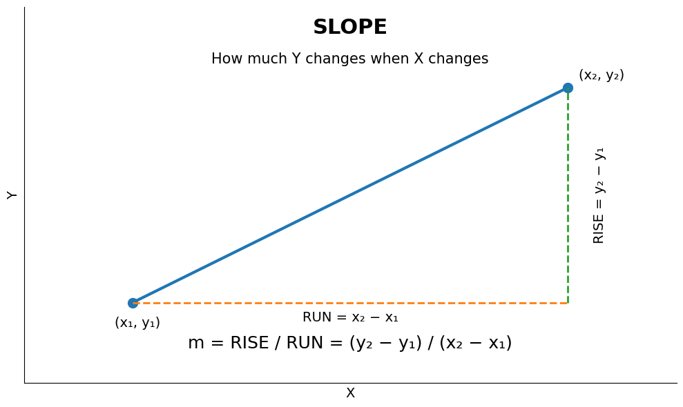

## Formulae  
$$
m = \frac{y_2-y_1}{x_2-x_1}
$$
## in simple writing
m = (y2 - y1) / (x2 - x1)


### The one idea to remember

**Slope = Rise ÷ Run**

```text
        Y
        ↑
        |                 ● (x₂, y₂)
        |                 │
        |                 │  RISE
        |                 │  y₂ − y₁
        |        ↗────────┘
        |      ↗
        |    ●────────────────→
        | (x₁, y₁)     RUN
        |              x₂ − x₁
        +────────────────────────→ X
```

So:

$$
\boxed{m=\frac{\text{RISE}}{\text{RUN}}}
$$

which is:

$$
\boxed{m=\frac{y_2-y_1}{x_2-x_1}}
$$

**Mental model:**

> **Slope tells me how much Y changes when X moves.**

<!-- [Download the simple slope diagram](sandbox:/mnt/data/simple_slope_diagram.png) -->

And this connects **directly** to Paul's Raspbery Pi Pico W potentiometer example:

```text
X1 = potentiometer start reading
X2 = potentiometer max reading
Y1 = Min Voltage desired
Y2 = Max Voltage desired


Y = Voltage
X = Pico's ADC reading


RISE = 3.3 − 0
RUN  = 65536 − 430

              3.3
Slope = ─────────────
             65106
```

So don't try to memorize `m = (y₂-y₁)/(x₂-x₁)` yet.

Just burn this into your head first:

**SLOPE = HOW MUCH UP ÷ HOW MUCH ACROSS**.


- in node
```js
function calSlope(StartReading, MaxReading, MinSetVal, MaxSetVal){
    let x = (MaxSetVal - MinSetVal) / (MaxReading - StartReading) 
    return x
}

let picoStartRead = 200;
let picoLastRead = 35000;

let MinVoltageVal = 0;
let MaxVoltageTarget = 3.3;

let result = calSlope(picoStartRead, picoLastRead, MinVoltageVal, MaxVoltageTarget)


console.log(`Slope Calculation Summary:
- x1: ${picoStartRead}
- x2: ${picoLastRead}
- y1: ${MinVoltageVal}V
- y2: ${MaxVoltageTarget}V
- Calculated Slope: ${result}`);
```  

- in python
```py
def cal_slope(start_reading, max_reading, min_set_val, max_set_val):
    x = (max_set_val - min_set_val) / (max_reading - start_reading)
    return x

pico_start_read = 200
pico_last_read = 35000

min_voltage_val = 0
max_voltage_target = 3.3

result = cal_slope(pico_start_read, pico_last_read, min_voltage_val, max_voltage_target)

# Dynamic print statement displaying all variables
print(f"""Slope Calculation Summary:
- x1: {pico_start_read}
- x2: {pico_last_read}
- y1: {min_voltage_val}V
- y2: {max_voltage_target}V
- Calculated Slope: {result}""")
```