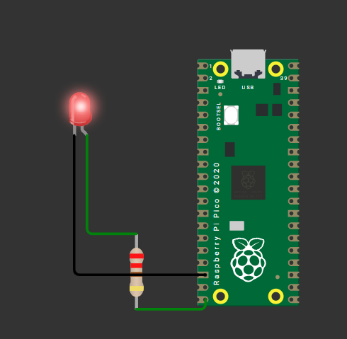

```py
from machine import Pin
from time import sleep


led = Pin(15, Pin.OUT); # grab the pin number 15 & mark it as a output with name led

while True:
  led.value(1)
  sleep(0.3)
  led.value(0)
  sleep(0.3)
```
kept resistance at `220`  
  