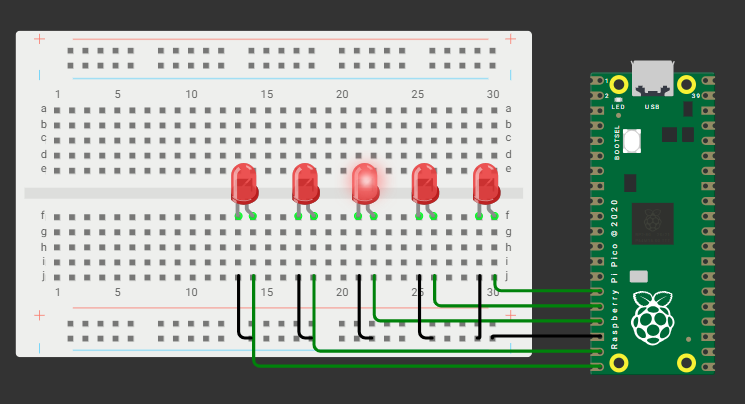

```py
from machine import Pin
from time import sleep

led1 = Pin(11, Pin.OUT);
led2 = Pin(12, Pin.OUT);
led3 = Pin(13, Pin.OUT);
led4 = Pin(14, Pin.OUT);
led5 = Pin(15, Pin.OUT);


while True:
  # led 1
  led1.on()
  sleep(0.3)
  led1.off()
  sleep(0.3)
  # led 2
  led2.on()
  sleep(0.3)
  led2.off()
  sleep(0.3)
  # led 3
  led3.on()
  sleep(0.3)
  led3.off()
  sleep(0.3)
  # led 4
  led4.on()
  sleep(0.3)
  led4.off()
  sleep(0.3)  
   # led 5
  led5.on()
  sleep(0.3)
  led5.off()
  sleep(0.3)   
```

  
