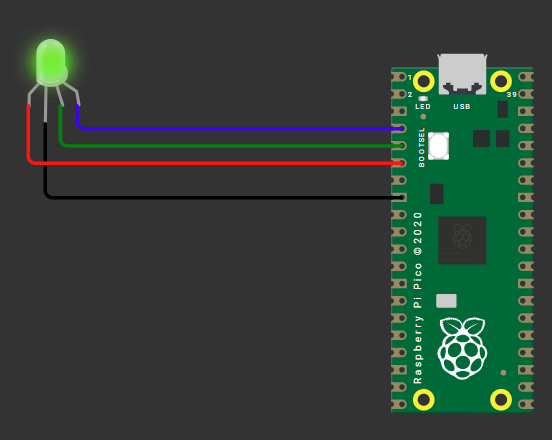

common pin: `cathode`  
```py
from machine import Pin
from time import sleep

blue = Pin(2, Pin.OUT)
green = Pin(3, Pin.OUT)
red = Pin(4, Pin.OUT)

def set_color(r, g, b):
    red.value(r)
    green.value(g)
    blue.value(b)

while True:
    # Red
    set_color(1, 0, 0)
    sleep(1)
    # Green
    set_color(0, 1, 0)
    sleep(1)
    # Blue
    set_color(0, 0, 1)
    sleep(1) 

    # you can play with paramters & create new color combo   
```

  