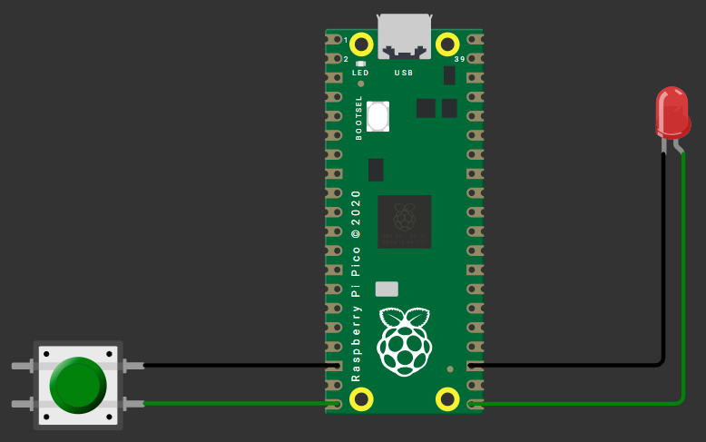
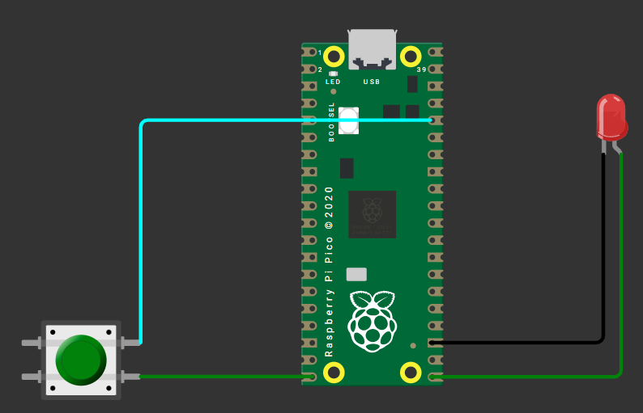

## 1. `GND`✅ `3V3`❌
```py
from machine import Pin
from time import sleep

button = Pin(15, Pin.IN, Pin.PULL_UP)
led = Pin(16, Pin.OUT)

while True:
    if button.value() == 0:
        led.on()
    else:
        led.off()
    sleep(0.1)
```
  

## 2. `GND`❌ `3V3`✅ 
```py
from machine import Pin
from time import sleep


button = Pin(15, Pin.IN, Pin.PULL_DOWN)
led = Pin(16, Pin.OUT)

while True:
    if button.value() == 1:
        led.on()
    else:
        led.off()
    sleep(0.1)
```
  