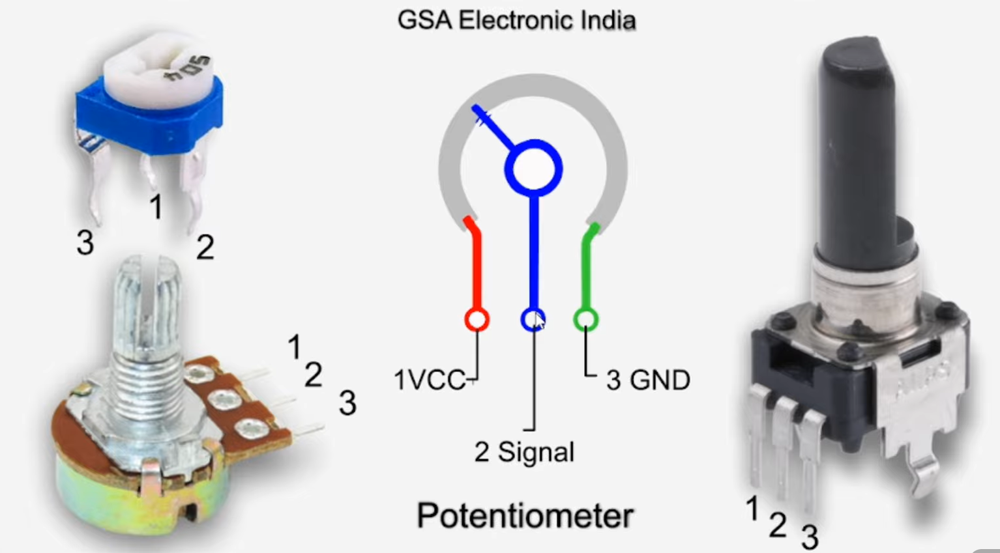
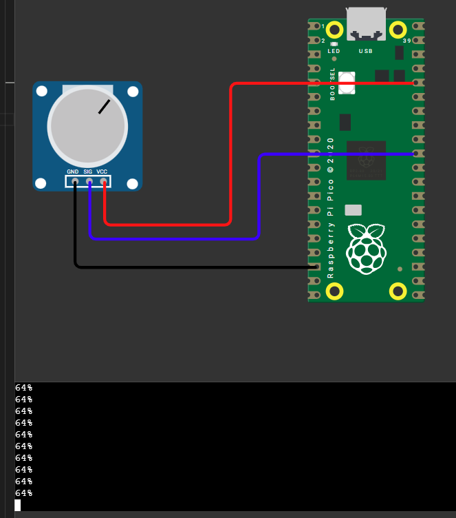
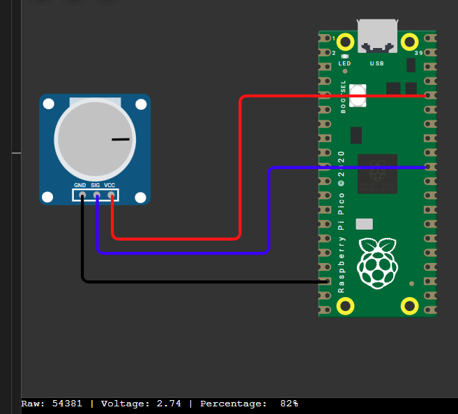
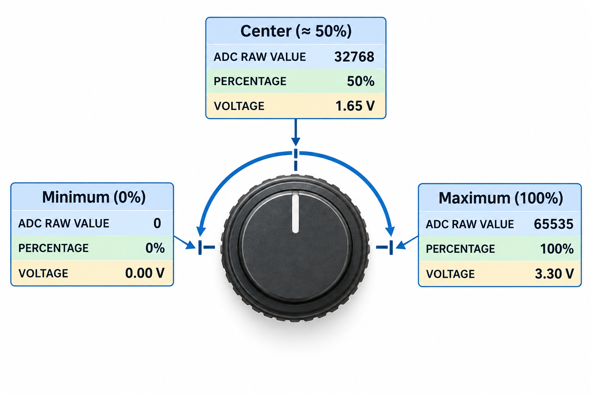

  
```py
from machine import Pin, ADC;
from time import sleep;

potVal = ADC(Pin(26)); # from SIG to GP26

while True:
    # 1. Read the 16-bit value (0-65535)
    # 2. Divide by 65535 and multiply by 100 to get the percentage
    # 3. Convert directly to an int to drop the decimal
    reading = int((potVal.read_u16() / 65535) * 100)
    print(f"{reading}%")
    sleep(0.1)
```
just in case if your max value is different & you want to find it
```py
print(f"Max raw value: {potVal.read_u16()}") # rotate to max & get that value & use it - int((potVal.read_u16() / <here>) * 100)
```
  
```py
from machine import Pin, ADC
from time import sleep

potVal = ADC(Pin(26))  # from SIG to GP26

while True:
    # 1. Read the 16-bit value (0-65535) once per loop
    rawVal = potVal.read_u16()
    
    # 2. Calculate the percentage (0-100%)
    percentage = int((rawVal / 65535) * 100)
    
    # 3. Calculate the voltage (0 to 3.3V)
    voltage = (rawVal / 65535) * 3.3
    
    # Dynamic print statement updating the same line
    print(f"Raw: {rawVal:<5} | Voltage: {voltage:.2f} | Percentage: {percentage:>3}%", end="\r")
    
    sleep(0.1)
```
  
  