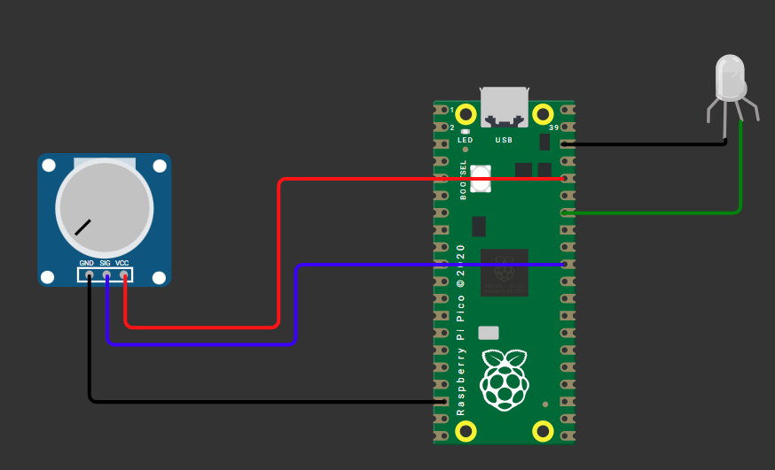
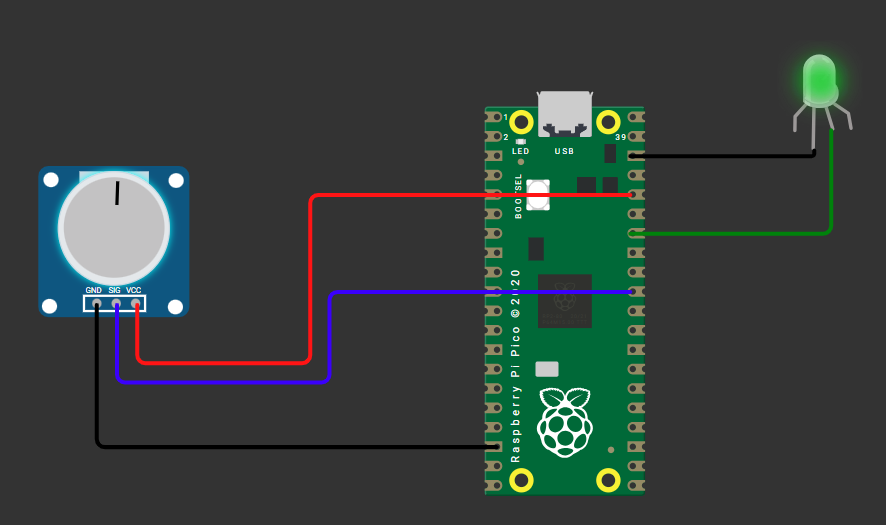
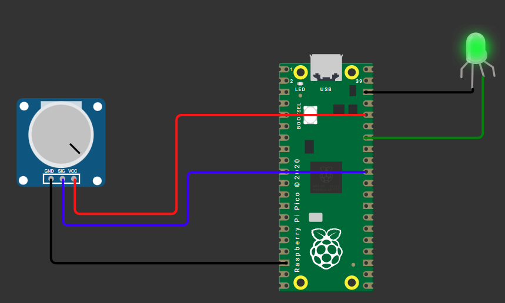

```py
from machine import Pin, ADC, PWM;
from time import sleep;

potVal = ADC(Pin(26)); # from SIG to GP26

# use RGB in Cathode
myLed = PWM(Pin(28));
myLed.freq(1000);

while True:
    # 1. Read the 16-bit value (0-65535) & assign it rawValue 
    # 2. use led variable & pass the rawValue to it in duty cycle
    rawValue = potVal.read_u16()
    myLed.duty_u16(rawValue)    
    sleep(0.1)
```
- all left

- mid

- all right

