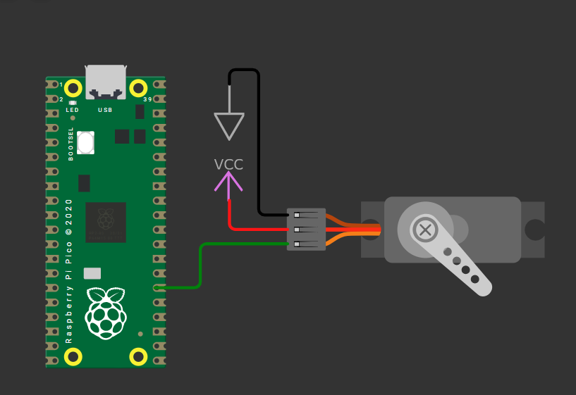

```py
# in pico w we default has 3.3v. we need 5v here, we can use external volgate using VCC & GND symbol  for that
# GND symbol = gnd1:GND => Servo1:GND
# VCC Symbol = vcc1:VCC => Servo1:V+
# pico:GP20 => Servo1:PWM

from machine import Pin, PWM;
from time import sleep;

servo = PWM(Pin(20));

servo.freq(50)

def set_angle(x):
    min_duty = 1000
    max_duty = 9000
    dutyVal = int( min_duty + (x/180) * (max_duty - min_duty))
    servo.duty_u16(dutyVal)

while True:
    for angle in range(0, 181, 10): # range(start, stop, step)
        set_angle(angle)
        sleep(0.2)

    for angle in range(180, -1, -10): # range(start, stop, step)
        set_angle(angle)
        sleep(0.2)
```
- The servo continuously rotates 180 degrees and reverses back to its starting position

