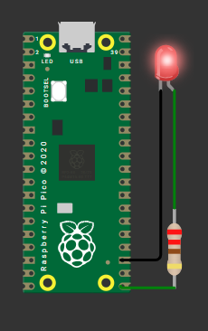

```py
from machine import Pin;
from time import sleep;

myLed = Pin(16, Pin.OUT)
dalay_time = 1.1;

while True:
    myLed.value(1);
    sleep(dalay_time)
    myLed.value(0);
    sleep(dalay_time)
    dalay_time = dalay_time - 0.1;

    if(dalay_time <= 0.1):
        sleep(2);
        myLed.value(0);
        break;
```
  