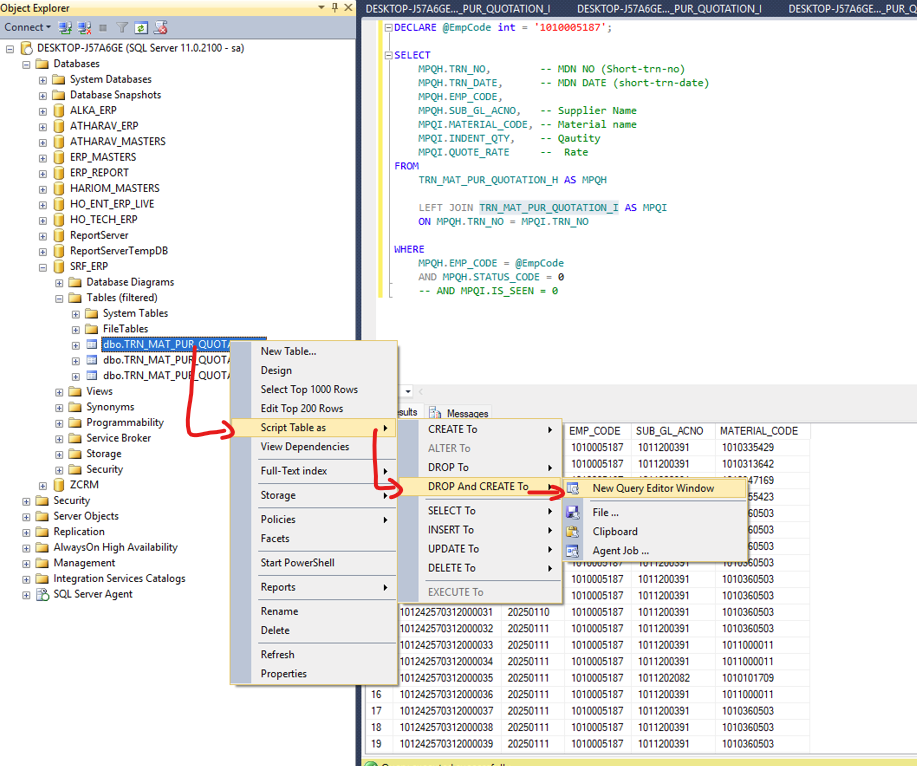
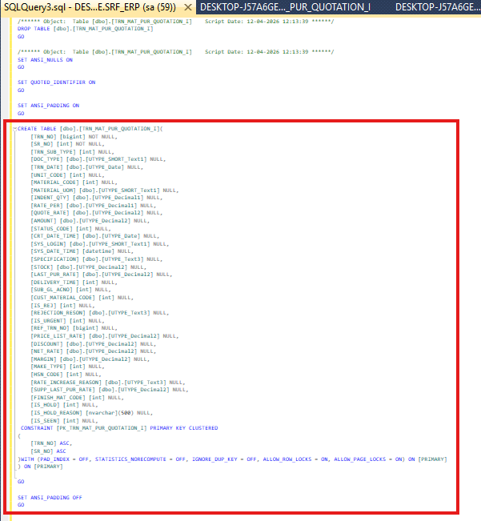

### 'Right click on Table` 
```yml
Script Table as:
                DROP And CREATE To =>
                                    New Query Editor Window
```  
  

Copy from `CREATE TABLE` statement to all the way bottom  
  
paste this snippet into you documentation.  