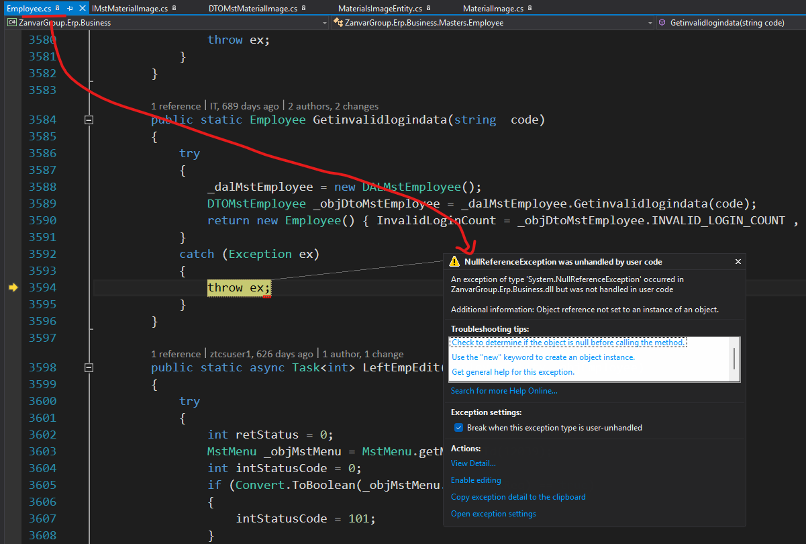
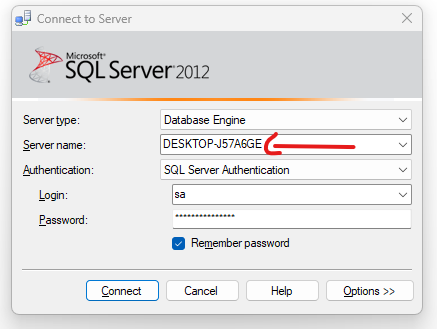

  
if this error Occures the your Connection String changed to live from local at `Web.config` files.  
like this  
```csharp
<add name="MasterDBConnection" connectionString="Data Source=10.10.1.18;Initial Catalog=HARIOM_MASTERS; ...  />
<add name="TransactionDBConnection" connectionString="Data Source=10.10.1.3;Initial Catalog=SRF_ERP; ... />
```  
we need to change it back to local again  

- open `SMSS` & copy server name from it  
  
1. change `Data Source=<your_server_name>;`
2. for `MasterDBConnection` change `Catalog` to `ERP_MASTERS`   
```csharp
<add name="MasterDBConnection" connectionString="Data Source=DESKTOP-J57A6GE;Initial Catalog=ERP_MASTERS; ...  />
<add name="TransactionDBConnection" connectionString="Data Source=DESKTOP-J57A6GE;Initial Catalog=SRF_ERP; ... />
```  