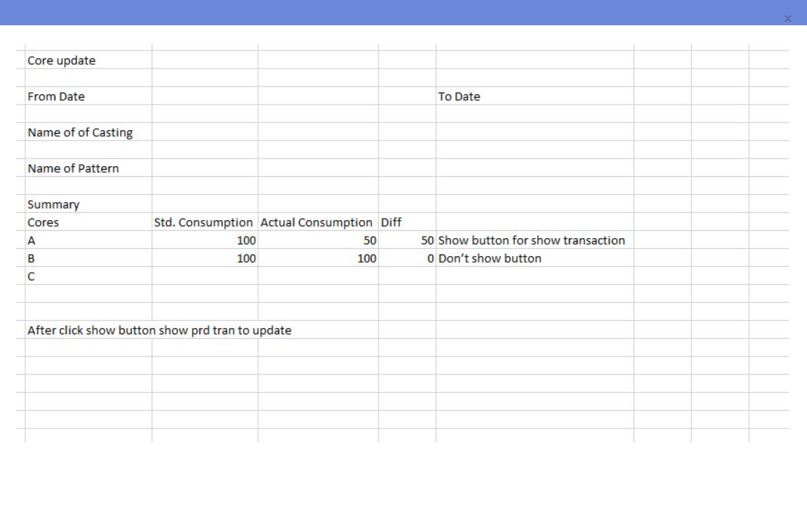

## Date: `06-02-2026 (Friday | शुक्रवार)` to `27-02-2026 (Friday | शुक्रवार)`      
```yml
Work        : PIR - Final Inspection (New Menu)
Flow        : Quality Assurance=> Process Inspection=> PIR - Final Inspection (Menu ID = 13017)
Dal         : DALTrnPirFinalInspectionH, DALTrnPirFinalInspectionI, DALTrnPirFinalInspectionISpecification
BO          : PrdProcessInpection, PirFinalInspectionI, PirFinalInspectionISpecification
Controller  : PirFinalInspectionController
View        : PirFinalInspection/Index, PirFinalInspection/PirFinalInspectionList, PirFinalInspection/CreatePirFinalInspectionList
Ticket      : 
```  
----------------------------------------------------------------------------------------------------  

## Date: `27-02-2026 (Friday | शुक्रवार)` to `10-03-2026 (Tuesday | मंगलवार)`  

```yml
Work        : Core Consumption (New Menu)
Flow        : Production ⇒ Core Production ⇒ Core Consumption (Menu ID = 80504)
Dal         : DALCoreConsumption
BO          : CoreConsumption
Controller  : CoreConsumptionController
View        : CoreConsumption/Index
Ticket      : 180
```  
- Operating Tables  
```sql
SELECT * FROM MST_PATTERN_DETAILS_I
SELECT * FROM TRN_PRD_MAT_I_POUR
SELECT * FROM TRN_MAT_POST
SELECT * FROM ERP_MASTERS..MST_MATERIALS
```   
----------------------------------------------------------------------------------------------------  