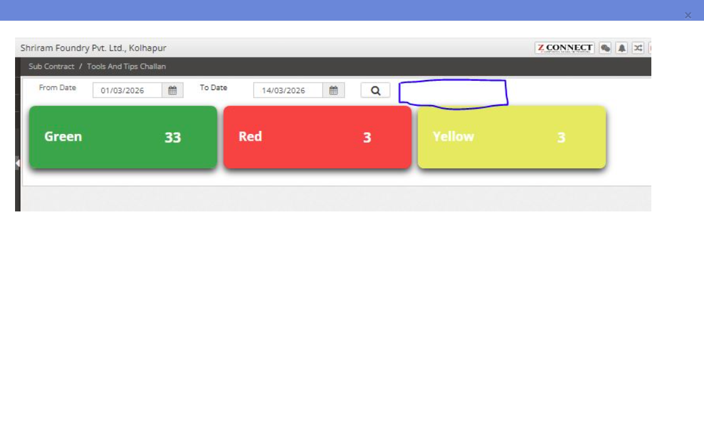
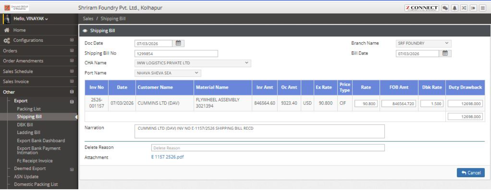

#### Date: `11-03-2026 (Wednesday | बुधवार)` to `14-03-2026 (Saturday | शनिवार)`  
```yml
Work        : Injecting Amend no into all 6 menus expect SPC. AMEND_NO should be saved into TRN_PIR_H table => CONFIG_AMEND_NO Column
Flow        : Quality Assurance => Process Inspection => All Menus
Dal         : 
              1. DALTrnPirH [ Create(), Approve(), UpdatePirAnalysis(), ApprovePirAnalysis() ] 
              2. PIRMachineList [  GetPIRMachineList() ]
              3. DALProductOperationWiseGaugeI [ GetMatOperationWiseProcessList(), GetMatOperationWiseProcessListForScan()] 
              4. DALProductOperationWiseGaugeIProcess [ GetMatOperationWiseProcessList(), GetMatOperationWiseProcessListForScan() ]
BO          :
              1. PrdProcessInpection [ insert(), GetExistingAsync(), PirRandomApproval(), UpdatePirAnalysis(), ApprovePirAnalysis(), GetExistingForSalvage()  ]
              2. DALProductOperationWiseGaugeH [ GetPIRMachineList() ]
              3. ProductOperationWiseGaugeI [ GetMatOerationWiseProcessLst() ]
              4. ProductOperationWiseGaugeIProcess [ GetMatOerationWiseProcessLst(), GetMatOperationWiseProcessListForScan()]
Controller  : PrdProcessInpectionController, PirProcessInspectionController, PirAutoController, PirScanQrController, PirAnalysisController
WFC         : 8 classes, 5 controllers, 13 view files
Ticket      :
```  
- Operating Table  
```
1. TRN_PIR_H
2. TRN_PIR_FIRST_PIECE_APPROVAL
3. TRN_PIR_FIRST_PIECE_APPROVAL_SPECIFICATION
```  
----------------------------------------------------------------------------------------------------

## Date: `15-03-2026 (Sunday | रविवार)`  
### Work
  
```yml
Description : Add new Branch name dropdown(checkbox) & and populate color codes & flow after that based on selected branch codes
Flow        : Sub Contract => Challan => Tools and Tips Challan => Resharp  
WFC         : 2
Ticket      : 201
```  
### Programming
```yml
Controller  : ToolsAndTipsChallanController
View        : ResharpToolTipChallanSummary
```  
- analogy
```
- before search button, need a branch name dropdown
- Reference: Direct Challan => New Button (DirectChallan/EwaybillChallenPending)
```
----------------------------------------------------------------------------------------------------  
## Date: `17-03-2026 (Tuesday | मंगलवार)`
### Work: `Export ROTEP Claim`  
  
```yml
Description : Appending two columns ROTEP Rate & ROTEP Amount and saving it in Database accordingly.  
Flow        : Sales => Other => Export => Shipping Bill => New Button => Entry Selection
Ticket      : 204
```  
### Database
##### New column in old tables 
```yml
TRN_SALE_PACK_I: 
                    1. ROTEP_RATE	UTYPE_Decimal1:decimal(14, 3)	Checked
                    2. ROTEP_AMOUNT	UTYPE_Decimal1:decimal(14, 3)	Checked
```
### Programming
```yml
DTO         : DTOTrnSalePackI
Dal         : DALTrnSalePackI
BO          : ShippingBill
Controller  : ShippingBillController
View        : Create.cshtml, Details.cshtml, Edit.cshtml, Approve.cshtml
WFC         : 8
```  
```sql
SELECT * FROM TRN_SALE_PACK_I WHERE TRN_NO = '101252690713000001'

-- for approve page
UPDATE TRN_SALE_PACK_H 
	SET STATUS_CODE = 101 
	WHERE TRN_NO = '101252690713000001';

UPDATE TRN_SALE_PACK_I 
	SET STATUS_CODE = 101 
	WHERE TRN_NO = '101252690713000001';
--


SELECT * FROM TRN_SALE_PACK_H WHERE TRN_NO = 101252690713000001
SELECT * FROM TRN_SALE_PACK_I WHERE TRN_NO = 101252690713000001
```   
----------------------------------------------------------------------------------------------------  
## Date: `18-03-2026 (Wednesday | बुधवार)` to `29-03-2026 (Sunday | रविवार)`  
### Work: `ReadIng Type` ⇒ `Station-No` ⇒ `Auto-Reading-Sr-No`  
```yml
Flow        : 
                1. Production => Configuration => Product Operation Wise Gauges => New => [ First Approval Tab & Process Inspection Tab ]  
                2. Production => Configuration => Product Operation Wise Gauges - Amend => New => Any row selection => [ First Approval Tab & Process Inspection Tab ]  

WFC         : 14
Ticket      : 206
```  
### Programming
```yml
Dal         : DALMstAutoGaugeStation
BO          : ProductOperationWiseGauge, ProductOperationWiseGaugeAmend, MstAutoGaugeStation
Controller  : ProductOperationWiseGaugeController, ProductOperationWiseGaugeAmend
View        : POWG(Create, Approve, Edit, Delete, Details), POWGA(Create, Approve, Edit, Delete, Details) 
```  
### Database
##### Operation Tables
```yml
- PRODUCT_OPERATION_WISE_GAUGE_I
- PRODUCT_OPERATION_WISE_GAUGE_I_PROCESS
- MST_AUTO_GAUGE_STATION
```  
##### New Table 
```yml
- MST_AUTO_GAUGE_STATION
STATION_CODE	    int	            Checked
COMPANY_ID	        int	            Checked
STATION_NAME	    nvarchar(50)	Checked
IP_ADRESS	        nvarchar(50)	Checked
LINK_SERVER_ID	    nvarchar(50)	Checked
STATION_TABLE_NAME	nvarchar(50)	Checked
STATUS_CODE	        int	            Checked
```
##### New column in old tables 
```yml
READING_TYPE	    int	            Checked

to both 
- PRODUCT_OPERATION_WISE_GAUGE_I
- PRODUCT_OPERATION_WISE_GAUGE_I_PROCESS
```  
----------------------------------------------------------------------------------------------------  

