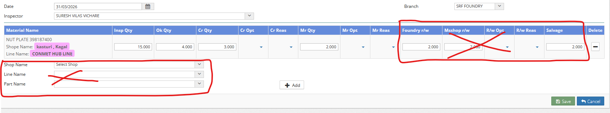
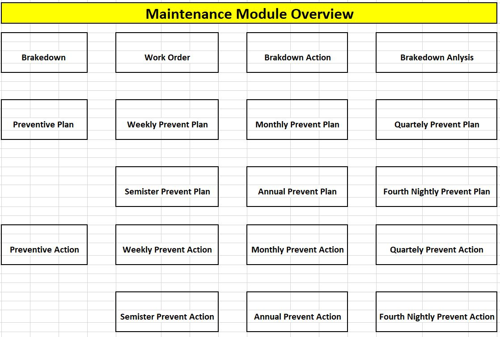

#### Date: `01-04-2026 (Wednesday | बुधवार)` to `08-04-2026 (Wednesday | बुधवार)`  
  
### Work
```yml
Description : Rework of Final Inspection
Flow        : Production => Mshop Production => Rework Final Inspection (New Menu, MENU_ID = 80418)
WFC         : 10
Ticket      : 194
```  
### Database
##### Tables
```yml
TRN_MSHOP_PRD_H
TRN_MSHOP_PRD_I
```  
### Programming
```yml
Dal         : DALTrnMshopPrdH, DALTrnMshopPrdI
BO          : ReworkFinalInspection
Controller  : ReworkFinalInspectionController
View        : Index, MiddlePage, Create, Edit, Delete, Details
```   
### Git Push message
```
Rework Inspection Commit
```  
----------------------------------------------------------------------------------------------------  

## Date: `09-04-2026 (Thursday | गुरुवार)` to `10-04-2026 (Friday | शुक्रवार)`
### Work
```yml
Description : Line Selection drop down & Edits upon it  
Flow        : Quality_Assurance => Configuration => PIR Robo Material Config
WFC         : 04
Ticket      : 216
```  
### Database
##### New Tables
1. LINE_WISE_ROBO_CONFIGURATION
```yml
COMPANY_ID:	        int	
MACHINE_ID:	        int	
ASSET_CODE:	        int	
MATERIAL_CODE:	    int	
OPERATION_CODE:	    int	
MACHINE_IP:	        varchar(100)	
AUTO_MACHINE_ID:	int	
TABLE_NAME:	        varchar(50)	
PART_SHORT_NAME:	varchar(50)	
LOCAL_MACHINE_ID:	int	
LINK_SERVER_IP:	    nvarchar(50)	
ASSET_IP_ADDRESS:	UTYPE_SHORT_Text2:nvarchar(20)	
LASER_PRINT_IP:	    UTYPE_SHORT_Text2:nvarchar(20)	
SR_NO:	            int	
LINE_CODE:	        int	
```  

2. ROBO_LINE
```yml
LINE_CODE:	        int
LINE_NAME:	        UTYPE_Text1:nvarchar(100)
LINE_LINKED_SERVER: UTYPE_SHORT_Text2:nvarchar(20)
```  
### Programming
```yml
Dal         : DALPirRoboMaterialConfig
BO          : PirRoboMaterialConfig
Controller  : PirRoboMaterialConfigController
View        : Index
```  
----------------------------------------------------------------------------------------------------  
## Date: `12-04-2026 (Sunday | रविवार)` to `14-04-2026 (Tuesday | मंगलवार)`  
### Work
```yml
Description : Login Popup
Flow        : Home Page
WFC         : 04
Ticket      : 11
```  
### Database
##### Tables
```yml
TRN_MAT_PUR_QUOTATION_H
TRN_MAT_PUR_QUOTATION_I
```  
##### New column in old tables 
```yml
TRN_MAT_PUR_QUOTATION_I: IS_SEEN	int	Checked
```
```sql
DECLARE @EMP_CODE int = '1010005187';

SELECT
	MPQH.TRN_NO,
	MPQH.TRN_DATE,
	MPQH.EMP_CODE,
	MPQH.SUB_GL_ACNO,
	MPQI.MATERIAL_CODE,
	MPQI.INDENT_QTY,
	MPQI.QUOTE_RATE
FROM
	TRN_MAT_PUR_QUOTATION_H AS MPQH

	LEFT JOIN TRN_MAT_PUR_QUOTATION_I AS MPQI
	ON MPQH.TRN_NO = MPQI.TRN_NO
	AND ISNULL(MPQI.IS_SEEN, 0) = 0

WHERE 
	MPQH.EMP_CODE = @EMP_CODE
	AND MPQH.STATUS_CODE = 0
```   
### Programming
```yml
Dal         : DALTrnMatPurQuotationI
BO          : MaterialDemandNote
Controller  : HomeController
View        : Index
```  
----------------------------------------------------------------------------------------------------    
#### Date: `15-04-2026 (Wednesday | बुधवार)` to  `21-04-2026 (Tuesday | मंगलवार)`
  
### Work
```yml
Description : Maintainance Home Page Cards
Flow        : Maintaincance (Home page)
WFC         : 15
Ticket      : 12
```  
### Database
##### Tables
```yml
# Stored Procedure (returns Single Object)
SP_MAINTENANCE_STATUS
```  

### Programming
```yml
Dal         : DalMaintenanceStatus 
BO          : MaintenanceStatus
Controller  : MaintenanceStatusController
View        : Index.cshtml, BreakDownList.cshtml, CreateBreakDownAction.cshtml, CreateBreakDownAnalysis.cshtml, CreatePreventiveAction.cshtml, CreatePreventivePlan.cshtml, CreateWorkOrder.cshtml, PendingBreakDownActionList.cshtml, PendingBreakDownAnalysisList.cshtml, PendingPreventiveActionList.cshtml, PendingPreventivePlanList.cshtml, PendingWorkOrderList.cshtml
```  
----------------------------------------------------------------------------------------------------  

#### Date: `23-04-2026 (Thursday | गुरुवार)` to `26-04-2026 (Sunday | रविवार)`   
### Work
```yml
Description : Part weight & PART_RATE_PER_KG mandate Implemetation  
Flow        : Procurement => Purchase Order => Direct Purchase Order => NEW  
WFC         : 9
Ticket      : 2627-000020
```  
### Database
##### New column in old tables 
```yml
# TRN_PO_MAT_I
PART_RATE_PER_KG	UTYPE_Decimal1:decimal(14, 3)	Checked
```  
### Programming
```yml
Dal         : DALTrnPoMatI
BO          : DirectOrder, DirectOrderAmend, PoMaterialI 
Controller  : DirectOrderController
View        : Create.cshtml, Approve.cshtml, Edit.cshtml, Delete.cshtml, Details.cshtml
```  
----------------------------------------------------------------------------------------------------  

#### Date: `28-04-2026 (Tuesday | मंगलवार)` to `06-05-2026 (Wednesday | बुधवार)`  
### Work
```yml
Description : Multiple OT pending approval POPUP modals
Flow        : HRM => Salary => Salary Process => NEW => Pending row => process name block => Process Button  
WFC         : 4
Ticket      : 2627-000022
```  
### Programming
```yml
Dal         : DALGetApprovalPendingOTforSalaryLock
BO          : GetApprovalPendingOTforSalaryLock
Controller  : SalaryProcessController
View        : OrderLstCreate
```  
### Git
```yml
Commit		: OT pending approval POPUPs Commit
Push Date   : 
```  
----------------------------------------------------------------------------------------------------  