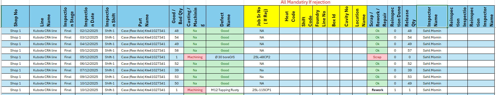

#### Date: `07-05-2026 (Thursday | गुरुवार)` to `14-05-2026 (Thursday | गुरुवार)`   
  
### Work
```yml
Description : CR & MR Popup
Flow        : Production => Mshop Production => Final Inspection Entry => New button
WFC         : 8
Ticket      : 2627-000025
```  
### Database
##### Tables
- New Table `TRN_MAT_REJECTION_INSPECTION`  
```yml
TRN_NO              : BigInt
SR_NO               : INT
TRN_SUB_TYPE        : INT
TRN_DATE            : UTYPE_Date:varchar(8)
MATERIAL_CODE       : INT
CR_QTY		        : UTYPE_Decimal2
MR_QTY		        : UTYPE_Decimal2
JOB_SR_NO	        : UTYPE_SHORT_Text2:nvarchar(20)
HEAT_CODE	        : UTYPE_SHORT_Text2:nvarchar(20)
SHIFT_CODE	        : INT
FOUNDRY_LINE_NO	    : INT
BOX_ID		        : UTYPE_SHORT_Text2:nvarchar(20)
CAVITY_NO	        : INT
LOCATION_NAME	    : UTYPE_SHORT_Text2:nvarchar(20)
STATUS_CODE         : INT
SYS_CHANGE_DATETIME : datetime
SYS_LOGIN           : UTYPE_SHORT_Text1:nvarchar(8)
```  
### Programming
```yml
Dal         : DALTrnMatRejectionInspection
BO          : TrnMatRejectionInspection, FinalInspection
Controller  : FinalInspectionEntryController
View        : CreateByShop, EditByShop, DeleteByShop, DetailsByShop
```  
### Git
```yml
Commit      : 
Push Date   : 
```  
----------------------------------------------------------------------------------------------------  

#### Date: `15-05-2026 (Friday | शुक्रवार)` to `11-06-2026 (Thursday | गुरुवार)`
### Work
```yml
Description : Material MDN Status
Flow        : Material Management => Dashboard (New Item Parent) => MDN Status (New Menu)
WFC         : 9
Ticket      : 
```  
### Database
##### Stored Procedure [4]  
1. SRF
- Item wise
```sql
SP_GET_DB_WISE_MATERIAL_MDN_DASHBOARD_DATA
-- [SP_GET_DB_WISE_MATERIAL_MDN_DASHBOARD_DATA]  'companyId', 'dbType', 'materialCode'    
-- [SP_GET_DB_WISE_MATERIAL_MDN_DASHBOARD_DATA]  '101', '0', '1010328497'
-- [SP_GET_DB_WISE_MATERIAL_MDN_DASHBOARD_DATA]  '101', '1', '1010328497'
```
- Stock group wise
```sql
SP_GET_DB_WISE_STOCK_LIST_GROUP_MDN_DASHBOARD_DATA
-- [SP_GET_DB_WISE_STOCK_LIST_GROUP_MDN_DASHBOARD_DATA]  'companyId', 'dbType', 'stockListGroupCode'    
-- [SP_GET_DB_WISE_STOCK_LIST_GROUP_MDN_DASHBOARD_DATA]  '101', '0', '1010000047'
-- [SP_GET_DB_WISE_STOCK_LIST_GROUP_MDN_DASHBOARD_DATA]  '101', '1', '1010000047'
```   
2. Hari OM
- Item wise
```sql
SP_GET_DB_WISE_MATERIAL_MDN_DASHBOARD_DATA_FOR_HO
-- [SP_GET_DB_WISE_MATERIAL_MDN_DASHBOARD_DATA_FOR_HO]   'dbType', 'materialCode'    
-- [SP_GET_DB_WISE_MATERIAL_MDN_DASHBOARD_DATA_FOR_HO]   '0', '1011300528'
-- [SP_GET_DB_WISE_MATERIAL_MDN_DASHBOARD_DATA_FOR_HO]   '1', '1011300528'
```
- Stock group wise
```sql
SP_GET_DB_WISE_STOCK_LIST_GROUP_MDN_DASHBOARD_DATA_FOR_HO
-- [SP_GET_DB_WISE_STOCK_LIST_GROUP_MDN_DASHBOARD_DATA_FOR_HO]  'dbType', 'stockListGroupCode'    
-- [SP_GET_DB_WISE_STOCK_LIST_GROUP_MDN_DASHBOARD_DATA_FOR_HO]  '0', '1010000047'
-- [SP_GET_DB_WISE_STOCK_LIST_GROUP_MDN_DASHBOARD_DATA_FOR_HO]  '1', '1010000047'
```

### Programming
```yml
Dal         : DALMaterialMdnStatus
BO          : MaterialMdnStatus
Controller  : MaterialMdnStatusController
View        : Index.cshtml, Aside.cshtml    
```  
### Git
```yml
Commit      : CR & MR Popup + Material MDN Dashboard Module
Push Date   : 
```  
----------------------------------------------------------------------------------------------------   